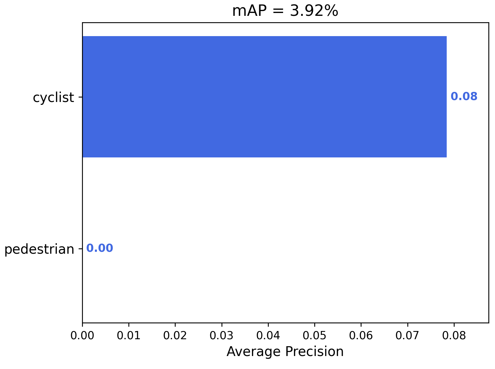

# TwoWheels

_OpenCV, PyTorch_

TwoWheels is a video-based object detection project for identifying cyclists and pedestrians. I fine-tuned architectures Faster R-CNN, SSD and YOLOv8, whose predictions are evaluated on a set of 30 images:

|              | Train / Predict Time | mAP@.5 |
| ------------ | -------------------- | ------ |
| Faster R-CNN | Slow                 | 67.82  |
| SSD          | Fast                 | 3.92   |
| YOLOv8       | Fast                 | 90.33  |

We can observe that the SSD model performs very poorly (primarily due to low input resolution) compared to the more robust Faster R-CNN. That said, the state-of-the-art YOLOv8 model predictably takes the crown.

## Data

Images and labels were retrieved from the Tsinghua-Daimler Cyclist Benchmark (TDCB)'s validation dataset (see their [website](http://www.gavrila.net/Datasets/Daimler_Pedestrian_Benchmark_D/Tsinghua-Daimler_Cyclist_Detec/tsinghua-daimler_cyclist_detec.html)). The original bounding boxes were labelled with 6 categories: "pedestrian", "cyclist", "motorcyclist", "tricyclist", "wheelchairuser", and "mopedrider." I have condensed these into "pedestrian", "cyclist", and "other" for simplicity. Here is an example of their annotated images:

_Citation: X. Li, F. Flohr, Y. Yang, H. Xiong, M. Braun, S. Pan, K. Li and D. M. Gavrila, "A new benchmark for vision-based cyclist detection", In proceedings of IEEE Intelligent Vehicles Symposium (IV), pages 1028-1033, June 2016_

## Faster R-CNN

_Credit: Jonathan Hui on Medium ([link](https://jonathan-hui.medium.com/understanding-feature-pyramid-networks-for-object-detection-fpn-45b227b9106c))_

Faster R-CNN is a two-stage object detection model that is built on top of Fast R-CNN and R-CNN (or Region-based CNN). Albeit slower than SSD, Faster R-CNN can be more accurate for identifying small objects (especially using FPN). The pretrained model that I've chosen to use is the **fasterrcnn_resnet50_fpn** from PyTorch with 4 components:

1. Image preprocessing (i.e. convert dimensions from 2048x1024 to 1333x667)
2. ResNet50 backbone with a 4-layer Feature Pyramid Network (FPN)
3. Region Proposal Network (RPN), upon which Regions of Interest (ROIs) are generated based on objectness and anchor-based bounding boxes
4. ROI heads, where ROIs are pooled and fed into FC layers for class and bounding box predictions

To adapt this model for cyclist detection (and pedestrian / other), I fine-tuned the model on 100 new images (with a batch size of 5) for 10 epochs1. It's interesting to note here that backpropagation is dependent on 4 loss gradients: 2 for RPN and 2 for ROI. Here is what the training curve looks like after adding all 4 losses together:

In order to evaluate the model's performance, we can use a metric called **Mean Average Precision** (mAP). For each class, we calculate the Intersection over Union (IoU) of predicted and actual bounding boxes. If this value is >=0.5, the prediction is considered a true positive. We can thus compute a running precision and recall graph - the integral of which we call an Average Precision. Repeating this for all classes, we arrive at the mAP.

Here's what the mAP looks like on a testing set of 30 images (only pedestrians and cyclists are present in the ground truths):

We can also visualize the classes and bounding boxes that the model outputs. Below is a gif of its predictions on images that were used during training:

And its predictions on images that were not used during training:

The model seems to perform reasonably well on both in-sample and out-of-sample data. In particular, its bounding boxes are able to pick up on small objects accurately. One issue is that the model appears to have trouble differentiating between cyclists and pedestrians.

## SSD

_Credit: SSD: Single Shot Multibox Detector paper ([link](https://arxiv.org/pdf/1512.02325))_

Single Shot Multibox Detector (SSD) is a one-stage object detection model. The pretrained model that I've chosen to use is the **ssd300_vgg16** from PyTorch with 3 components:

1. Image preprocessing (i.e. convert dimensions from 2048x1024 to 300x300)
2. VGG16 backbone with 5 Extra Feature Layers
3. Anchor-based classification and bounding box heads. These predict objects from the last VGG layer and all Extra Feature layers

Due to the poor performance of the SSD model using 100 training images, I fine tuned it with 300 training images for 10 epochs. Note that I also increased the batch size to 20 and decreased the LR by a factor of 10 because of issues with loss convergence. Here's the training curve on combined classification and bounding box loss:

The calculated mAP:

Finally, predictions on the same set of images visualized for Faster R-CNN (although these are all in-sample data for SSD):

Although fast, we notice the model does an extremely poor job at identifying and classifying objects. In fact, it thinks every object it sees is a cyclist! These results are in spite of the fact that the training set has been increased to 300 images.

I believe that this poor performance may be due to:

1. Resizing the original image to 300x300 obfuscates smaller objects
2. Weaker feature extraction from VGG16 backbone compared to ResNet50 (especially fine-tuned on low epochs)
3. Classification issues when many objects on the same scale are close to each other
4. Inherent trade-off between speed and accuracy in SSD architecture

## YOLOv8

_Credit: You Only Look Once: Unified, Real-Time Object Detection paper ([link](https://arxiv.org/pdf/1506.02640))_

Like SSD, YOLO is a one-stage object detection model. The original YOLO divides an input image into a SxS grid upon which each cell predicts 1 class and B bounding boxes (which are possibly larger than the grid cell).

Many iterations have come after the original paper, and YOLOv8 is one of the cutting-edge versions today. Thus, I used Ultralytic's built-in YOLOv8 training method to fine-tune the model on 300 images for 20 epochs. Note that images are resized to 1024x1024 before training.

We can take a look at the mAP:

And of course, we can visualize predictions on the same set of images using YOLO's built-in method (these are all in-sample data for YOLO as well):

We can see that not only is YOLO extremely fast, it also does an excellent job at identifying and classifying almost every object. It's interesting to note here that on a separate set of validation data (images 600-650, not shown above), the model has a hard time predicting an elderly person with a child as pedestrians - so perhaps more training is needed.

## Credits

Thanks to João Cartucho for the mAP calculation script, which I've used with minor adjustments ([original code](https://github.com/Cartucho/mAP)).

_Citation: J. Cartucho, R. Ventura and M. Veloso, "Robust Object Recognition Through Symbiotic Deep Learning In Mobile Robots," 2018 IEEE/RSJ International Conference on Intelligent Robots and Systems (IROS), Madrid, Spain, 2018, pp. 2336-2341, doi: 10.1109/IROS.2018.8594067_

### Footnotes

1 All training is only done on positive samples of the number of images specified (i.e. images that contain ground-truth labels).
